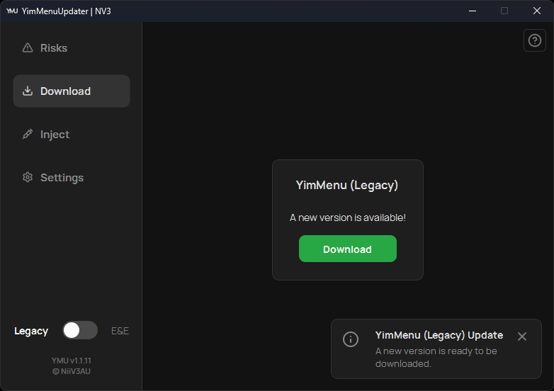
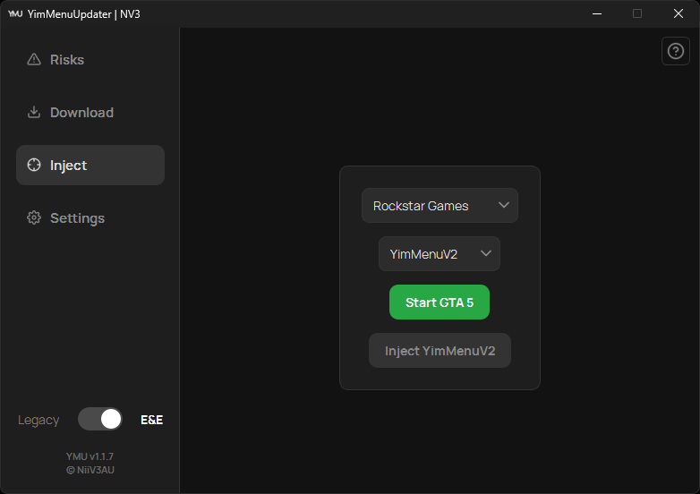
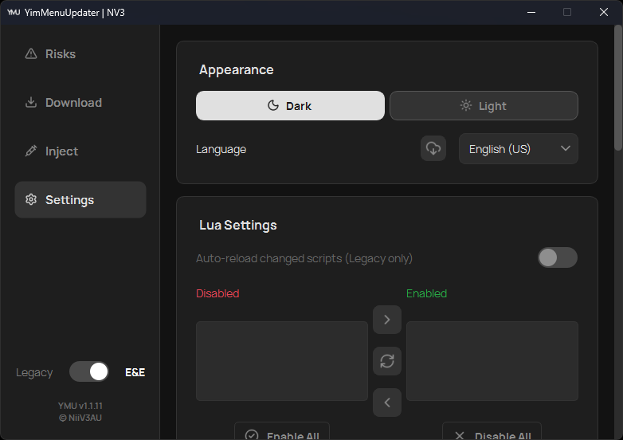
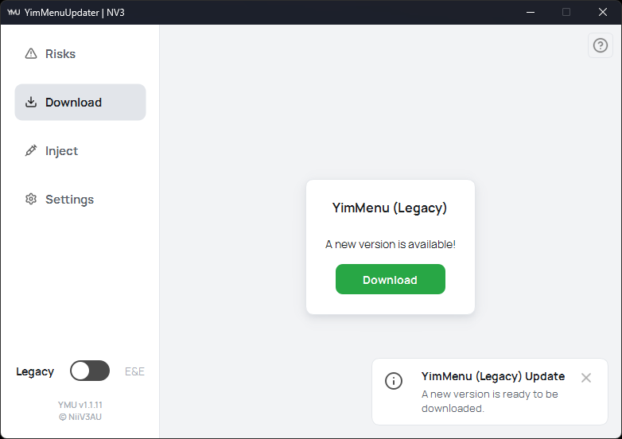
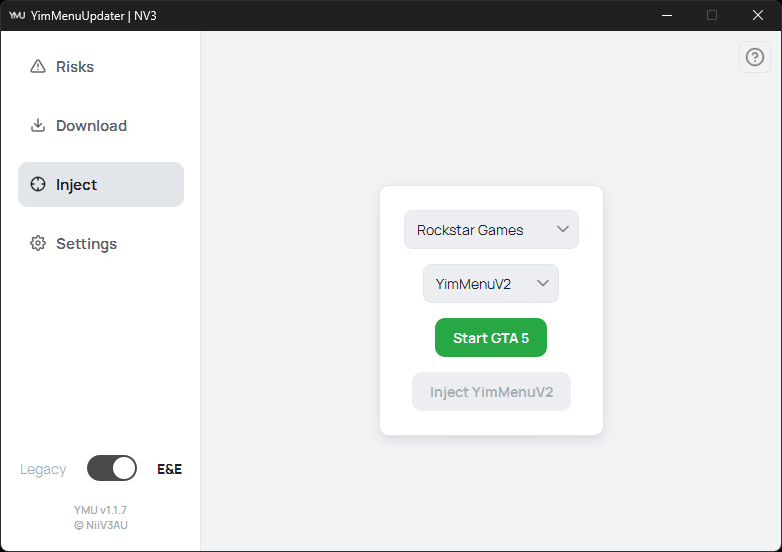
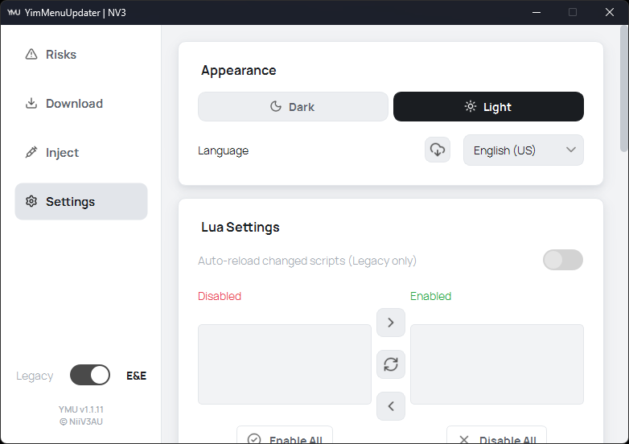

# YimMenuUpdater (YMU)

The modern, all-in-one launchpad for YimMenu. **Always updated, always ready.**

<div align="center">

[](https://ymu.pages.dev/)
[](https://github.com/NiiV3AU/YMU/releases/latest)
[](CHANGELOG.md)
[](https://github.com/NiiV3AU/YMU/releases)
[](https://www.virustotal.com/gui/file/707a8d841a39c42eacb1900d025cbcc08243ddd62c571bb107e0a9de5930ec8d)


</div>

[YMU](https://ymu.pages.dev/) is a sleek and powerful launcher for YimMenu that handles everything for you. From downloading the latest DLLs to injecting them into the game, YMU ensures a stable and seamless experience with a clean and intuitive user interface.

---

## ✨ Features

- **Dual-Edition Support:** Seamlessly switch between GTA V Legacy (YimMenu) and Enhanced (YimMenuV2) with instant auto-detection.
- **Automated DLL Management:** Download and update YimMenu with a single click, protected by SHA-256 integrity verification.
- **Smart Safety Checks:** Automatic 64-bit architecture validation and non-blocking BattlEye service detection with clear risk guidance.
- **Integrated Game Launcher:** Start GTA V directly via Steam, Epic Games, Rockstar Games Launcher, or a custom directory.
- **Resilient Injection Engine:** Built-in UTF-8 and ANSI path sanitization ensures reliable injection even on Windows accounts with special characters or accents.
- **Lua Script Manager:** Easily enable, disable, and organize scripts on the fly, with direct access to scripts folders and auto-reload settings.
- **Multi-Language Support:** Available in 15 languages with over-the-air translation updates directly within the app.
- **Modern UI/UX:** A clean, responsive interface featuring both dark and light modes.

---

## 🛡️ Safety & Transparency

- **Full source, in the open:** Every line of YMU lives here on GitHub. Don't just trust it; read it, or build the `.exe` yourself and compare.
- **Verified downloads:** YMU fetches YimMenu DLLs only from their official repositories and verifies each download's SHA-256 against the publisher's published hash before it is used.
- **Microsoft SmartScreen:** Because YMU isn't code-signed, a fresh release may trigger a SmartScreen prompt until it builds up enough reputation. You can always cross-check the published `YMU.exe` hash against its VirusTotal report.

> [!WARNING]
> **On third-party menus:** A matching checksum proves you received exactly what the publisher posted. It cannot prove that the publisher's source is, and forever stays, safe. YimMenu is a separate project, and a compromised upstream or supply-chain attack is outside YMU's control. Use mods at your own risk.

---

## 🚀 Getting Started

Download and run `YMU.exe` directly from the latest release. No installer required.

| [Download YMU.exe (Latest Release)](https://github.com/NiiV3AU/YMU/releases/latest) |
| :---------------------------------------------------------------------------------: |

---

## 🖼️ Screenshots

### Dark Theme

<div align="center">
  
  
  
</div>

### Light Theme

<div align="center">
  
  
  
</div>

---

## 🖼️ Project Evolution

<details>
<summary><b>A visual look back at earlier versions (v1.0.0 – v1.0.9)</b></summary>

> [!NOTE]
> For the complete, chronological release history and technical change notes, see **[CHANGELOG.md](CHANGELOG.md)**.

### v1.0.9

<div align="center">
  
</div>

### v1.0.3

<div align="center">
  
  
  
</div>

### v1.0.2

<div align="center">
  
  
</div>

### v1.0.1

<div align="center">
  
  
  
  
</div>

### v1.0.0

<div align="center">
  
  
</div>

</details>

---

## 📦 Building from Source

<details>
<summary><b>Click to expand instructions for developers</b></summary>
  
### First things first — get the source

| [Download Source Code](https://github.com/NiiV3AU/YMU/archive/refs/heads/main.zip) |
| :--------------------------------------------------------------------------------: |

### Set up the environment

YMU uses [**uv**](https://docs.astral.sh/uv/) for Python and dependency management. From the project root, a single command installs the right Python (`3.12`), every runtime dependency, **and** the build toolchain (Nuitka lives in the `dev` group):

```bash
uv sync
```

That's it, no manual package installs. For reference, `uv sync` pulls in [PySide6](https://pypi.org/project/PySide6/), [requests](https://pypi.org/project/requests/), and [pyinjector](https://pypi.org/project/pyinjector/) as runtime dependencies, plus [Nuitka](https://pypi.org/project/Nuitka/) for building. System and process interactions rely strictly on native Windows APIs via `ctypes` to eliminate false-positive antivirus flags.

> **Not using uv?** Dependencies are declared in `pyproject.toml`, so plain pip works as well:
> `python -m venv .venv && .venv\Scripts\activate`, then install the runtime dependencies and `pip install nuitka` to build.

### Run from source

```bash
uv run python src/main.py
```

### Creating the Executable (.exe)

This project uses **Nuitka** to create a high-performance, compact executable. From the project root, run:

```bash
uv run python -m nuitka --onefile --standalone --enable-plugin=pyside6 --windows-icon-from-ico=src/assets/icons/ymu.ico --include-data-dir=src/assets=assets --include-data-dir=src/ui/styles=ui/styles --windows-console-mode=disable --assume-yes-for-downloads --output-dir=dist --output-filename=YMU.exe src/main.py
```

This creates `YMU.exe` in the `dist` folder.

**Command Breakdown:**

- **`--onefile`**: Bundles everything into a single `.exe` file.
- **`--standalone`**: Includes all required libraries and dependencies so no external Python environment is needed.
- **`--enable-plugin=pyside6`**: Optimizes the build for Qt/PySide6.
- **`--windows-console-mode=disable`**: Prevents the console window from opening in the background.
- **`--windows-icon-from-ico`**: Embeds the application icon into the executable.
- **`--include-data-dir`**: Bundles the application `assets` and UI stylesheets (`src/ui/styles`).
- **`--assume-yes-for-downloads`**: Lets Nuitka fetch its C toolchain non-interactively.

> The official release build (see `.github/workflows/ymu_manual_release.yaml`) runs the same command with extra flags that stamp version/company metadata onto the `.exe` and strip unnecessary qt-plugins.

</details>

---

## ⭐ Support the Project

> [!IMPORTANT]
> **Show your support by giving this repository a ⭐. Thanks <3!**

---

## Disclaimer

> [!WARNING]
> Use this project for educational purposes only and use it at your own risk.

> [!CAUTION]
> I am not liable or responsible for any direct or indirect consequences that may result from the use of YMU or YimMenu.

---

## Credits

| **Core & Vision** | [**@xesdoog**](https://github.com/xesdoog) (Early Development)                                                      |
| :---------------- | :------------------------------------------------------------------------------------------------------------------ |
| **Localization**  | [**@TommyLam120**](https://github.com/TommyLam120) (zh_TW)                                                          |
| **Menu**          | [**YimMenu**](https://yim.gta.menu/)                                                                                |
| **Logo**          | [**Made with Figma**](https://figma.com)                                                                            |
| **Icons**         | [**Lucide**](https://lucide.dev/)                                                                                   |
| **Fonts**         | [**Manrope**](https://fonts.google.com/specimen/Manrope) & [**JetBrains Mono**](https://www.jetbrains.com/lp/mono/) |
